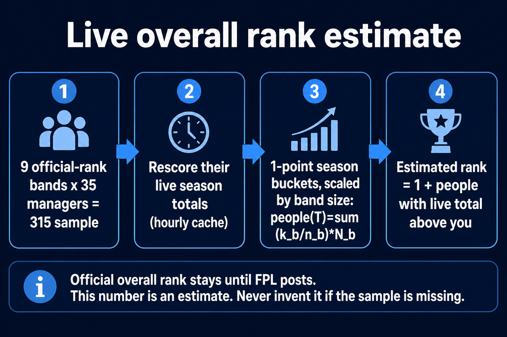
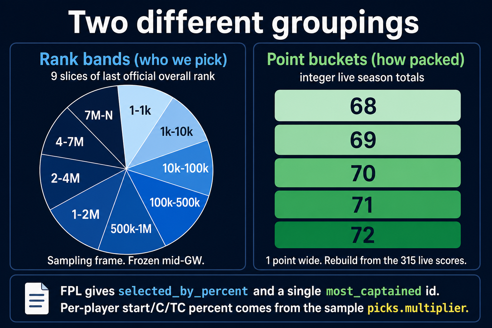
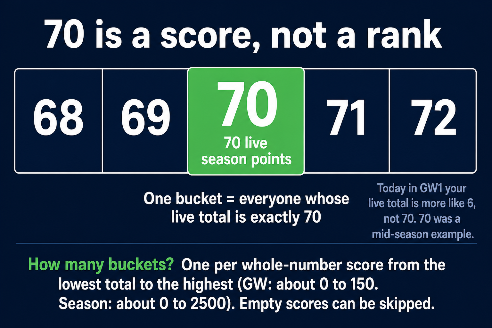
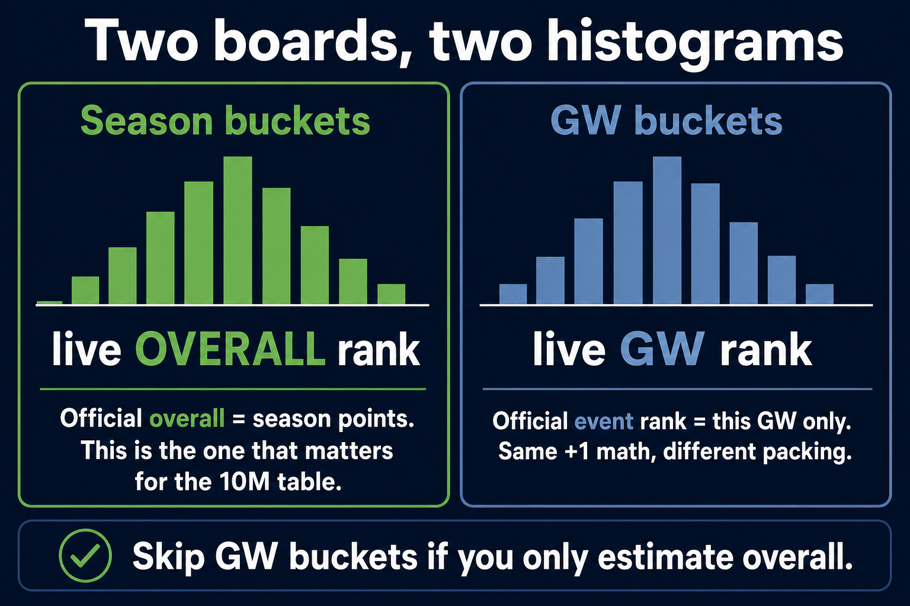
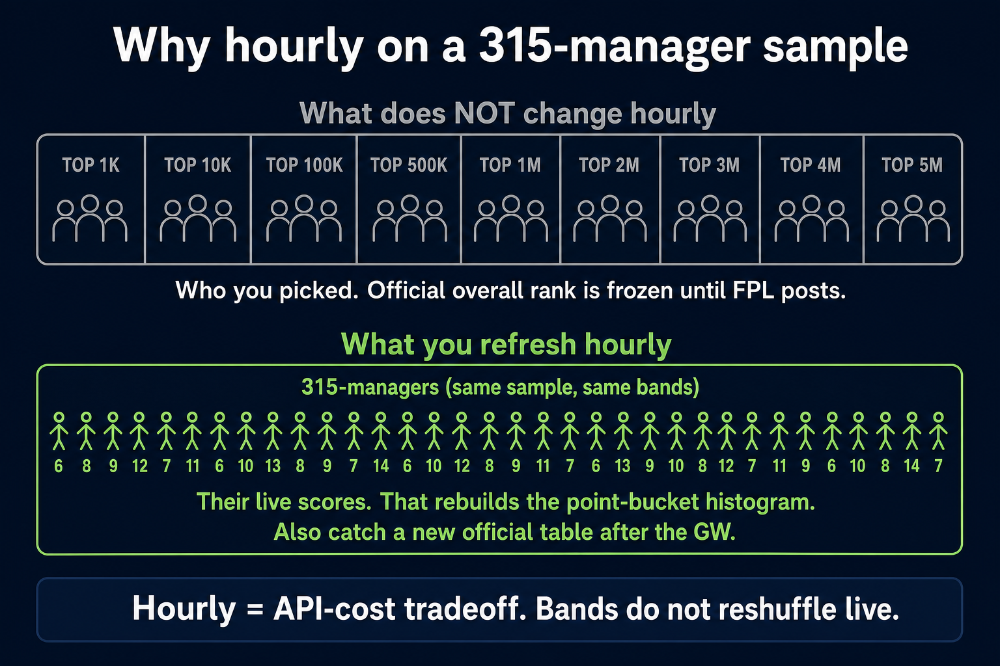
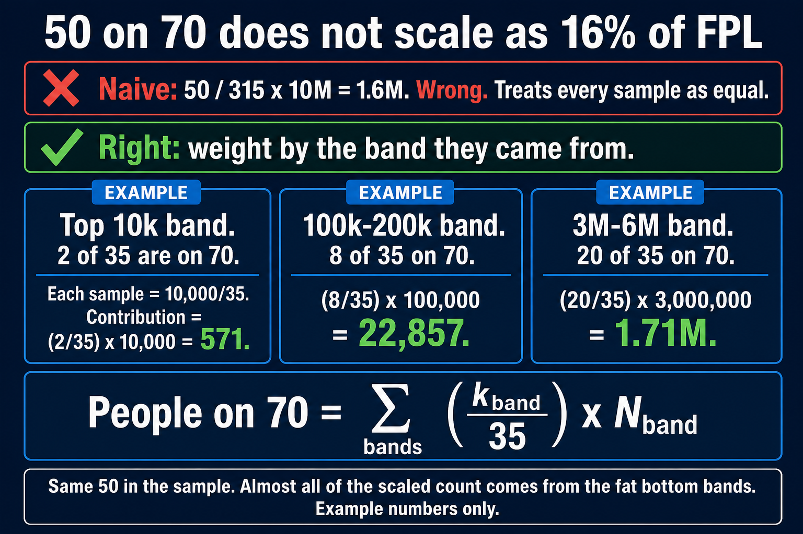
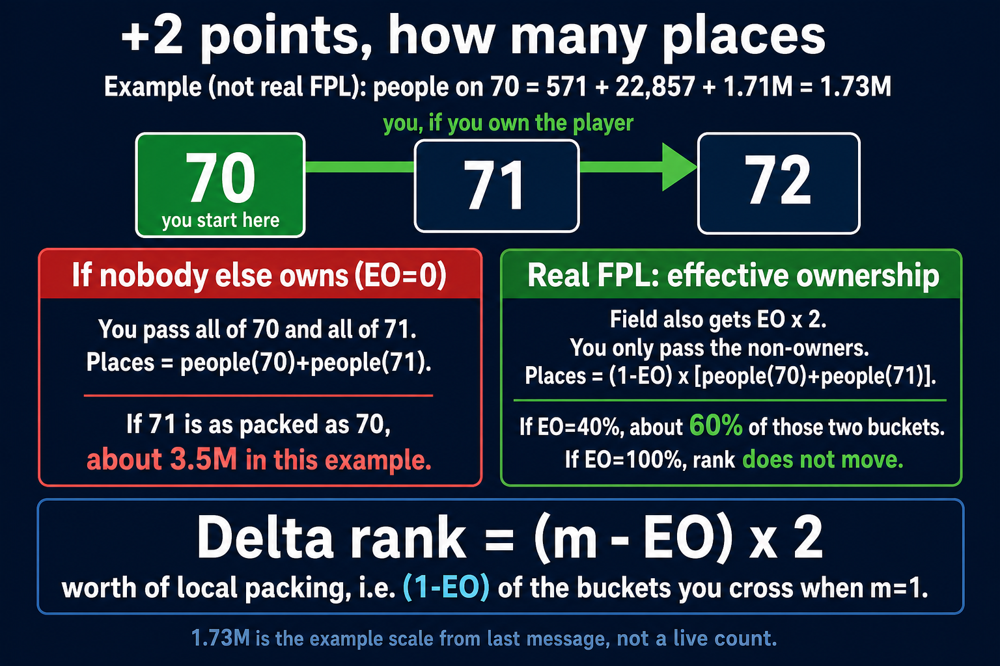
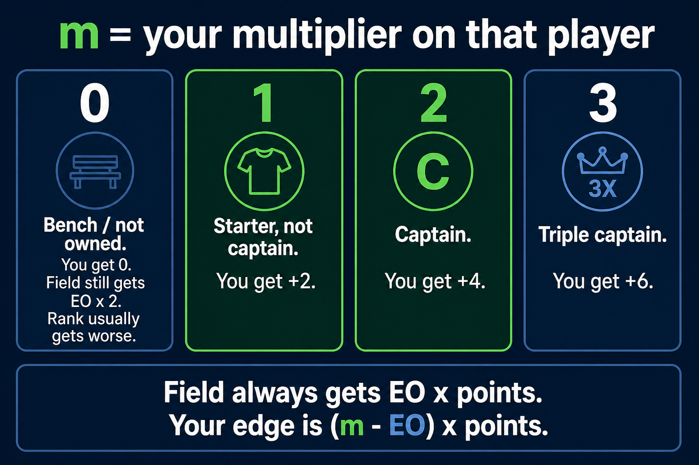
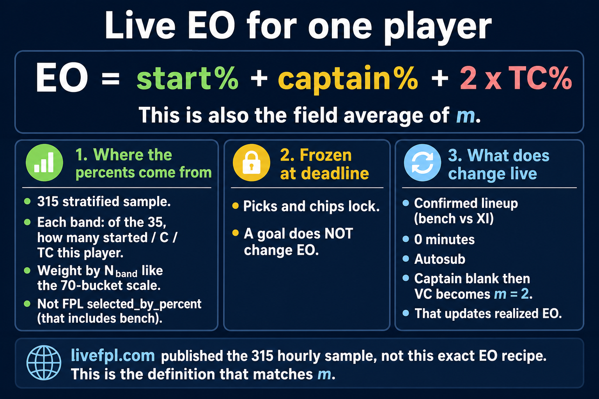
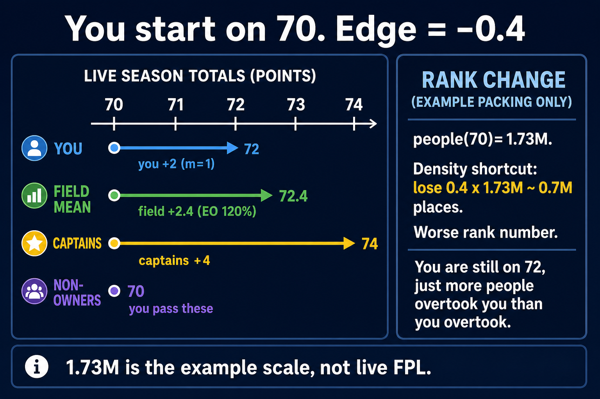

# fpl_live_leagues

Kotlin CLI and Dropwizard webapp for **live FPL tracking** during a gameweek (the livefpl.net live-rank / live-leagues experience, not the rest of that product).

- Enter an FPL entry ID for live GW points (gross / net after hit), projected bonus, autosubs, chip, official overall rank, live overall **estimate** + sample age, value, bank, players remaining, captain status
- Open a classic league by picker (mini leagues: `< 50` teams and no next standings page) **or** by numeric league ID
- Live league table: live rank, official rank, live total, GW net/gross, remaining, overall rank, value, chip (WC/FH/BB/TC/AM)
- Player-by-player XI + bench with minutes, raw points, projected vs confirmed bonus, C/VC, auto-sub in/out, live EO%
- Live games strip (your players, C/VC, bench, minutes, contribution) and 90s auto-refresh while fixtures are in progress
- Pre-season / before kickoff still renders the table from the official FPL API (zeros, remaining = full XI)

Uses only the official FPL API. Bootstrap, fixtures, and event-live payloads are cached in memory for ~20s. The overall-rank sample (classic league 314 identities + live totals + per-player `m`) is cached ~hourly.

Out of scope: transfer planner, price changes, accounts, ads. Live overall rank is a **stratified estimate**, not a live 10M leaderboard (FPL does not publish one).

## Requirements

- Java 11+ (17 or 21 is fine)
- Internet access (calls the public FPL API)

## CLI

Build:

```bash
./gradlew build
```

Run:

```bash
./gradlew run --args='YOUR_TEAM_ID'
```

Example:

```bash
./gradlew run --args='1234567'
```

### Find your team ID

In the browser URL on the Fantasy Premier League site:

- `https://fantasy.premierleague.com/entry/1234567/event/1`
- The team ID is the number after `/entry/` (`1234567`).

### Navigation

- `Up/Down` arrows (or `k/j`) to move
- `Enter` to select
- `Left` or `Esc` to go back (where supported)
- `q` to quit

### Install a launcher

```bash
./gradlew installDist
./build/install/fpl_live_leagues/bin/fpl_live_leagues YOUR_TEAM_ID
```

## Webapp

Dropwizard JSON API plus a dense live-tracker UI.

| Method | Path | Purpose |
| --- | --- | --- |
| GET | `/` | Live tracker UI |
| GET | `/health` | App health; also probes FPL bootstrap when cheap |
| GET | `/entries/{entryId}/live?gameweek=&autosubs=` | Home / live rank for one manager (default current GW, autosubs on) |
| GET | `/entries/{entryId}/mini-leagues` | Mini leagues for a team (`entryCount < 50 && !hasNext`) |
| GET | `/leagues/{leagueId}/live?gameweek=&autosubs=` | Live table for any classic league ID (capped at 50 with a note) |
| GET | `/entries/{entryId}/event/{gameweek}/picks?autosubs=` | Player-by-player live breakdown |
| GET | `/overall/live-estimate?gameweek=` | Cache status, sample age, band `n_b` for the live overall estimate |

Live math:

- **GW gross** = sum of effective player points × multiplier (captain 2× / TC 3×, bench 0 unless BB)
- **GW net** = GW gross − transfer hit (`event_transfers_cost`)
- **Live total** = official season total − official GW points + GW net (avoids double-counting)
- **Bonus** = official bonus when FPL has set it; otherwise 3/2/1 projected from BPS on that fixture
- **Autosubs** = FPL `automatic_subs` when present, then prospective FPL-style replacements (GK only for GK; 3 DEF / 2 MID / 1 FWD)
- **Chips** = WC / FH / BB / TC / AM (assistant manager)

FPL's **official** overall rank is shown unchanged. A secondary **live overall estimate** (and per-player EO) is attached on `GET /entries/{id}/live` only when the hourly sample cache is warm; otherwise the UI says estimate unavailable. See [Live overall estimate](#live-overall-estimate).

Config is Dropwizard YAML (`config.yml`). The HTTP connector listens on **8080**. Override the FPL API with `fplBaseUrl`.

Run from source:

```bash
./gradlew runWeb
```

Then open http://localhost:8080/ and http://localhost:8080/health

Fat jar:

```bash
./gradlew shadowJar
java -jar build/libs/fpl-web-1.0.jar server config.yml
```

## Tests

```bash
./gradlew test
```

Covers mini-league filtering, captain/bench multipliers, BPS bonus projection, auto-sub eligibility, GW net, live season total (no double-count), stratified `people(T)`, estimated rank, EO weights, and thin-sample unavailability.

## Docker

Multi-stage image (Temurin 17 JDK build → Temurin 17 JRE runtime), port 8080:

```bash
docker build -t fpl-web:1.3 .
docker run --rm -p 8080:8080 fpl-web:1.3
```

`Dockerfile.runtime` is a JRE-only image if you already built `fpl-web-1.0.jar`.

## Deploy to k3s

Manifests live in `k8s/`. They create namespace `fpl`, one replica, and a NodePort **30810 → 8080**. They do not touch `movie-api`.

On a machine that can build images:

```bash
docker build -t fpl-web:1.3 .
docker save fpl-web:1.3 | ssh randomnumber01@100.67.63.33 'sudo k3s ctr images import -'
```

Apply manifests (from this repo):

```bash
ssh randomnumber01@100.67.63.33 'sudo k3s kubectl apply -f -' < k8s/namespace.yaml
ssh randomnumber01@100.67.63.33 'sudo k3s kubectl apply -f -' < k8s/deployment.yaml
ssh randomnumber01@100.67.63.33 'sudo k3s kubectl apply -f -' < k8s/service.yaml
```

Check:

```bash
ssh randomnumber01@100.67.63.33 'sudo k3s kubectl -n fpl get pods,svc'
curl http://100.67.63.33:30810/health
```

The Deployment pins the pod to `randomnumber01` so a locally imported image does not need to exist on the worker. An optional Ingress (`k8s/ingress.yaml`) exposes path `/fpl` on the Traefik LoadBalancer; the supported access path is the NodePort.

### Honeycomb / OpenTelemetry

`fpl-web:1.7` ships the OpenTelemetry Java agent. When secret `fpl-honeycomb` (`HONEYCOMB_API_KEY`) is present in namespace `fpl`, the entrypoint enables the agent and exports traces, metrics, and logs over OTLP (`https://api.honeycomb.io`). HTTP requests, sample-refresh work (`fpl.sample.refresh`), HTTP/refresh/uncaught-error counters, and a `fpl.up` gauge are included. A shutdown hook flushes on SIGTERM (k8s pod stop). `kill -9` / OOM can still drop in-flight telemetry. Missing key: the app starts with the agent off (no crash). The raw key is never stored in Deployment YAML (entrypoint builds `OTEL_EXPORTER_OTLP_HEADERS` from the env var).


## Live overall estimate

This is an **estimate**, not a live 10M board. FPL freezes official overall rank mid-gameweek and does not publish a live leaderboard of ~10 million managers. v1 has **no GW-rank histogram** — only a live *season total* histogram built from a stratified sample.

Example numbers in the diagrams (1.73M, 3.5M, 0.7M, etc.) are **example arithmetic**, not live FPL counts.



*Estimate pipeline: official overall standings → hourly identity sample → live season totals + per-player m → histogram + EO. Not a scrape of a 10M live board.*

### Rank bands vs 1-point season buckets

Two different partitions:

- **Rank bands** — nine slices of *official overall rank* used only to draw a representative sample (and to weight it).
- **1-point season buckets** — integer live season totals `T`. `people(T)` lives on this axis. Rank itself is read from that histogram, not from summed player edges.



*Rank bands (who we sample) are not the same as 1-point season buckets (where we put live totals).*



*Each integer live season total T is its own bucket.*



*Live season total = official season total − official GW points + live GW net (bonus, autosubs, chips). Same math as the rest of the app.*

### Our 9 bands (not livefpl edges)

These are **our documented choice**. They are not claimed as livefpl.com bucket edges. livefpl.com has published that they take 35×9 hourly samples; we do the same *count* (35 per band, 315 target) against classic league **314**.

| Band | Official rank slice |
| --- | --- |
| 1 | 1–1,000 |
| 2 | 1,001–10,000 |
| 3 | 10,001–100,000 |
| 4 | 100,001–500,000 |
| 5 | 500,001–1,000,000 |
| 6 | 1,000,001–2,000,000 |
| 7 | 2,000,001–4,000,000 |
| 8 | 4,000,001–7,000,000 |
| 9 | 7,000,001–N |

`N = total_players` from `bootstrap-static`. Last-band slice size `N_b` is `N − 7,000,000` when `N > 7,000,000`; bands that start past `N` are dropped.

35 target ranks are spread evenly through each band, mapped to standings page (page size 50), and that slot is taken. If a page 500s/fails, that slot is **dropped**. `n_b` = successful samples in the band (can be `< 35`). Deep pages of league 314 500ing is expected; we never fabricate entries.



*Identities are cached ~hourly (official ranks freeze mid-GW). Live totals and per-player m use the same TTL.*

### people(T) and estimated rank

For integer live season total `T`:

```
people(T) = sum_over_bands (k_b / n_b) * N_b
```

- `k_b` = sampled managers in band `b` whose live total is `T`
- `n_b` = successful samples in band `b`
- `N_b` = official slice size of band `b`
- Skip empty `T`. If `n_b == 0`, that band contributes 0.
- **Never** use naive `(k / 315) * N_total`



*Each band scales by its own N_b / n_b. A hit in the 1–1,000 band is not worth the same as a hit in 7M–N.*

```
estimated overall rank = 1 + sum_{T > myLiveTotal} people(T)
```

Ties stay tied: people at your exact `T` do not count as above you. If the sample is too thin (fewer than 3 bands with `n_b > 0`, or fewer than 30 successful samples) the estimate is **unavailable** — we never invent a number.



*Rank comes from the live-total histogram, not from summing player edges.*

GET `/entries/{id}/live` never waits on a cold 315-fetch. Official rank is returned immediately. Estimate + EO attach only when the cache is already warm. First use (and then hourly) kicks a background refresh with backoff.

The last successful sample is atomically written to `data/live-overall-snapshot.json` (that is `/app/data/live-overall-snapshot.json` in the container; override with `overallSnapshotPath` in `config.yml` or `FPL_OVERALL_SNAPSHOT`). A process or pod restart loads it so estimate/EO attach on the first request; stale-while-revalidate still kicks a refresh if the file is older than 1h or the gameweek changed. Missing, corrupt, or thin files stay cold (`available=false`) and never invent a rank. Persist/load failures are logged and ignored. k8s mounts a hostPath volume (`/var/lib/fpl-web` on randomnumber01) at `/app/data` so rollouts keep the file, not only container crashes.

### m, EO, and edge

`m` is `picks.multiplier` after the same live evaluation as the rest of the app (autosubs, chips):

| m | Meaning |
| --- | --- |
| 0 | not in XI (bench / not owned) |
| 1 | starter |
| 2 | captain |
| 3 | triple captain |

Effective ownership:

```
EO = start% + captain% + 2·TC% = mean m
```

Each sampled manager is weighted by `N_b / n_b` for their band. FPL does **not** publish per-player captain% — only `selected_by_percent` and a single `most_captained` element id.



*m is the live multiplier, not raw ownership.*



*EO% on a player row is 100 × that weighted mean (e.g. 1.23 → 123%).*

```
edge = (m − EO) × points
```

Edge is a commentary number. **Rank itself comes from the histogram, not from summed edges.**



*Worked example only — the 70 and the EO in the image are not live FPL counts.*

### API / UI field names

On `GET /entries/{entryId}/live` (warm cache):

| JSON field | Meaning |
| --- | --- |
| `overallRank` | Official FPL overall rank (unchanged) |
| `overallRankLabel` | Always `"official"` |
| `liveOverallRankEstimate` | Estimated live overall rank, or `null` |
| `liveOverallEstimateAvailable` | `true` only when the sample clears the thin-sample bar |
| `liveOverallSampleAgeSeconds` | Age of the cached sample |
| `liveOverallSampleCount` | Successful sampled managers |
| `players[].eo` | Weighted mean `m` (1.23 = 123% EO) |

`GET /overall/live-estimate` reports `warm`, `available`, `sampleAgeSeconds`, `sampleCount`, `targetSampleCount`, `totalPlayers`, `gameweek`, `refreshing`, per-band `{index,startRank,endRank,nB,nSlice}`, and a `note`.

The UI keeps the official overall rank as-is and adds a secondary **Live overall** stat (`N (estimate)` or `estimate unavailable`) plus sample age. Player rows gain an **EO** column.

## Developer notes

- Kotlin concepts used in this project: `docs/kotlin-concepts.md`
- Live overall estimate diagrams: `docs/live-rank/`
